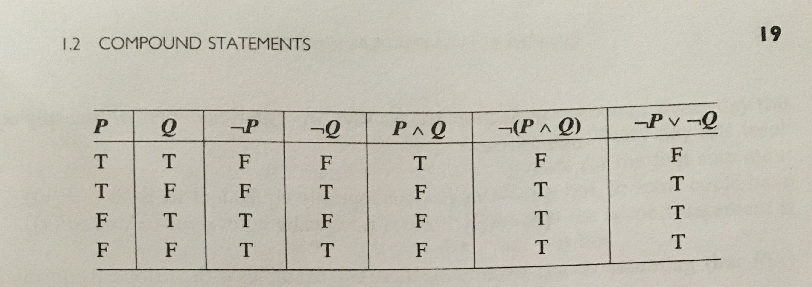

# Statements

* math (in a sense) to determine if a statement is true or false

* **axioms** : are given statements that other statements are deduced from

* **propositions** : are deductions made from axioms 

* **theorems** : are propositions that are particularly important 

* **proofs** : are the arguments that use logic to make deductions 

* A **statement** is any declarative sentence that is either true or false. 

* A **variable** is a symbol that stands for an undetermined number. 

* An **open statement** is any declarative sentence containing one or more variables that is not a statement but becomes a statement when the variables are assigned values. 

* A **quantifier** is an expression that indicates the scope (all, some, both)

* $\forall$ is the **universal quantifier** "for all" or "for every".

* $\exists$ is the **existential quantifier** "there is" or "there exists" 

* A quantifier applied to a variable is a **bound variable**

* A variable that is not bound is **free**
**Example 6** : If _n_ is an even integer, then $n^2$ is even. 

- this is a statement because the quantifier $\forall$ : "For every integer _n_, if _n_ is even, then $n^2$ is even." Making _n_ a bound variable. 

**Example 7** : A triangle has three sides. 

- "For every plane figure _T_, if _T_ is a triangle, then _T_ has three sides."

**Example 8** : The square of a real number is nonnegative. 

- "$\forall x$, if $x$ is a real number, then $x^2\geq 0$." 

**Example 10** : Some even numbers are multiples of 3. 

- "There exists an even integer that is a multiple of 3."

- prove by finding the existence of one such number (like 6)

**Example 11** : Some real numbers are irrational.

- "There exists  a real number _x_ such that _x_ is irrational." 

**Example 14** : A real-valued function $f(x)$ is **bounded** on the closed interval $[a,b]$ if $f(x)$ is defined on $[a,b]$ and $\exists$ a positive real number $M$ such that $|f(x)|\leq M$ $\forall x\in[a,b]$

**Example 15 a** : $\forall$ real numbers $x$, $\exists$ a real number $y\in y^3 =x$. 

- "Every real number has a cube root" (true)

- This is a consequence (result) of the Intermediate Value Theorem (if f is continuous on [a,b] then it takes on any value between f(a) and f(b))

**Example 15 b** : $\exists$ a real number $y\in \forall$ real numbers$x$, $y^3 =x$.

- "For **every** real number x is the cube of a **single** number y" (false)

- there exists a number single number y such that $y^3=x$ is true for all real numbers. (false) 

**Definition 1.1.3** If P is a statement, the **negation** of P, written $\neg P$ (and read "not P"), is the statement "P is false". 

- for statements P or $\neg P$, one is true and one is false. 

- every statement can be negated by adding "it is not true" in front of it (however this neglects what the statement actually means)

**Example 22** P : If _n_ is an even integer, then $n^2$ is even. ; $\neg P$: It is not true that if _n_ is an even integer, then $n^2$ is even. 

OR

P : For all integers _n_, if _n_ is even, then $n^2$ is even.

$\neg P$ : There exists an even interger _n_ such that $n^2$ is odd. 

* if we negate something with an existential quantifier, then a universal quantifier is required. 

_Rule 1_ : the negation of "For all x, P(x)" is "For some x, $\neg P(x)$. 

_Rule 2_ : the negation of "For somex, P(x)" is "For all x, $\neg P(x)$.

* The negation of $\exists x \in \forall y, P(x,y)$ is $\forall x, \exists y\in\neg P(x,y)$

**Example 26** : P: There is a real nuber whose square is negative. 

$\neg P$ : The square of every real number is not negative 

- note that saying "there is a real number whose square is nonnegative" would be incorrect since both P and $\neg P$ could both technically be true. 

**Example 29** : P: There is a continuous real-valued function $f(x)$ such that $f(x)$ is not differentiable at any real number c. 

$\neg P$: For every continuous real-valued function $f(x)$ , there is a real number c such that $f(x)$ is differentiable at c. 

# Compound Statements

**Definition 1.2.1** Let _P_ and _Q_ be statements.

1. The **conjunction** of _P_ and _Q_ , written $P\land Q$ (and read "P and Q") is the statement "Both P and Q are true." 
2. The **disjunction** of _P_ and _Q_, written $P\lor Q$ (and read "P or Q") is the statement "P is true or Q is true". 

* disjunction or "the inclusive or"

* conjunction : 3 ways to be false, disjunction : 3 ways to be true

* think of P and Q as variables for (T/F) statements

* **statement forms** are $P\land Q$, $P\lor Q$, $\neg P$, and so on 

* use truth tables where the statement columns are of all combinations 

* notice for $P\land Q$, that $\neg (P\land Q)$, and $(\neg P) \lor (\neg Q)$ are the same thing by the truth table below

**Example 9** 

P: Everyday this week was sunny or hot

* $\forall$ days this week $P \lor Q$ letting this P be for when it is sunny and Q for when it is hot. 

$\neg P$ : Some day this week was not sunny and not hot 

* $\exists$ days this week that were $(\neg P) \land (\neg Q)$

**Example 10**

P : There is a real number x such that $x>4$ and $x<10$

* $\exists x \in \mathbb{R}$ such that $P \land Q$, letting this P be the statement $x>4$ and Q be the statement $x<10$

$\neg P$ : If x is a real number, then $(\neg P) \lor (\neg Q)$

**Example 11** 

P : Every multiple of 6 is even and is not a multiple of 4. 

* $\forall x, ((\neg S(x)) \land (\neg T(x))$ where $S(x)=6n$ is odd and $T(x)=6n$ is a multiple of 4. 

$\neg P$ : There is a multiple of 6 that is odd or is a multiple of 4. 

* $\exists x \in (S(x)\lor T(x))$.

**Example 12** : There was a day this week that was sunny or hot

* is logically equivalent to the statement : There was a day this week that was sunny or there was a day this week that was hot. 

**Example 13** : here is a real number x such that $x>2$ or $x<5$

* is logically equivalent to the statement : There is a real number x such that $x>2$ or there is a real number x such that $x<5$.

**Example 14** : According to today's weather forecast, tomorrow will be cold and cloudy or cold and rainy. 

Let P, Q, and R be the statements

P : Tomorrow will be cold.

Q : Tomorrow will be cloudy.

R : Tomorrow will be rainy. 

$\Leftrightarrow$ According to today's weather forecast, $(P\lor Q)\land (P\lor R)$.

$\Leftrightarrow$ According to today's weather forecast, tomorrow will be cold and it will be cloudy or rainy. 

$\Leftrightarrow$ According to todays's weather forecast, $P\land (Q\lor R)$. 

---

* A statement form that is always true is called a **tautology**.

* A statement that is always flase is called a **contradiction**

* If S is a tautology then $\neg S$ is a contradiction. Likewise, if S is a contradiction then $neg S$ is a tautology 

* A consequence of the Archimedes Principle ($\forall x\in \mathbb{R} \exists$ an integer _n_ such that $n>x$) is that there are no "largest" real number

# Implications

* the "if-then" part of a statement is called an **implication**

* the "if" part gives the **premise** or the **assumption**

**Definition 1.3.1** : Let P and Q be statements. The **implication** $P\Rightarrow Q$ (read "P implies Q") is the statement "If P is true, then Q is true". 

**Example 1**

P : $3+2=5$

Q : $3+1+1=5$

$P\Rightarrow Q$ : If $3+2=5$, then $3+1+1=5$

**Example 5**

P : Gerald Ford was vice President under Jimmy Carter. 

Q : 2 < 7

* P is false and Q is true so $P\Rightarrow Q$ is true. False statements imply anything. 

**Example 8**

P : The function $f(x)=x^{2}$ is differentiable at 0. 

Q : The function $f(x)=x^{2}$ is continuous at 0. 

* $P\Rightarrow Q$ is true. Note there is also causality here since a theorem in calc. shows that differentiability implies continuity.

**Example 9**

P : The function $f(x)=x^{2}$ is continuous at 0. 

Q : The function $f(x)=x^{2}$ is differentiable at 0. 

* $P\Rightarrow Q$ is true. There is no causality but the implication is true because both P and Q are true. 

---

* when $x$ is assigned $a$ value a then $P(a)$ is called the **hypothesis** and $Q(a)$ is called the **conclusion**. 

**Example 11**
Prove or disprove S : "If _n_ and _m_ are odd integers, then _n + m_ must be even."

Reworded : "For all integers _n_ and _m_, $P\Rightarrow Q$

Where P is the open sentence "n and m are odd integers" and Q is the open sentence "n+m is even". 

Proof : 

Let _n_ and _m_ be odd integers. 

This means we can rewrite _n_ as $2t+1$ and _m_ as $2s+1$. Where _t_ and _s_ are integers. 

Thus , $n+m=(2t+1)+(2s+1)=2t+2s+2=2(t+s+1)$

Since $t+s+1$ is an integer, $n+m$ is even. 

QED. 

---

* a **counterexample** serves to disprove a statement with a universal quantifier, and is also the variable assigned to x that makes P(x) true and Q(x) false.  

* $\neg (P\Rightarrow Q)$ is logically equivalent to $P \land \neg Q$

* $P \land \neg Q$ : P is true and Q is false 

**Example 13**
Consider the statement : "The sum of two perfect square is perfect."

* $\forall$ integers _n_, _m_, $P\Rightarrow Q$ where P is _n_ and _m_ are perfect squares, and Q is the open sentence that $n+m$ is a perfect square. 

* The negation of this statment would be : $\exists$ integers _n_, _m_, such that $P \land \neg Q$

* "There exists integers _n_ and _m_ such that _n_ and _m_ are perfect squares but $n+m$ is not a perfect square." 

* counterexample : $4+9=13$, 13 is not a perfect square. 

* use a counterexample to disprove a statement with a universal quantifier. 

---

* P is a **sufficient condition**, meaning in order fot _Q_ to be true, it is _sufficient_ that _P_ be true. 

* Q is a **necessary condition**, meaning that _Q must_ be true in order for _P_ to be true. 

* In other words, if Q is false, then P is false. $\neg Q \Rightarrow \neg P$

* note that even if Q is true, P may be false. 

**Example 14** 
Let x be a real number. Let P be the statement "$x>5$" and Q be the statement "$x>0$"

* P is sufficient but not necessary 

* Q is a necessary condition but not sufficient 

# Contrapositive and Converse 

* an alternate way of proving $P\Rightarrow Q$ is to verify $\neg Q \Rightarrow \neg P$ , meaning to prove if Q is false then P is false. 

**Example 1**
Let P be "Aurora lives in Boston" and Q be "Aurora lives in Massachusetts". 

* $P\Rightarrow Q$

* $\neg Q \Rightarrow \neg P$ : If Aurora does not live in Bosten then they do not live in Massachusetts. 

**Definition 1.4.1** : The statement $\neg Q \Rightarrow \neg P$ is called the  **contrapositive** of the statement $P\Rightarrow Q$. 

**Example 2**
Implication : If it rained today, then the game was canceled.

Contrapositive : If the game was not cancelled, then it did not rain today. 

**Example 4** 
Prove that if _n_ is an integer and $n^2$ is even, then _n_ is an even integer. 

* To prove directly write $n^2=2t$ for some integer t. This gives us $n=\sqrt{2t}$ which doesn't tell us much. 

* proving the contrapositive : "if_n_ is odd, then $n^2$ is odd." 

Write $n=2t+1$, and square both sides giving 

$n^{2} =(2t+1)^{2}=4t^{2}+4t+1=2(2t^{2}+2t)+1$

Thus because $(2t^{2}+2t)$ is an integer, it follows that $n^{2}$ is odd. QED. 
 
---

**Definition 1.4.2** : The statement $Q \Rightarrow P$ is called the  **converse** of the statement $P\Rightarrow Q$.

**Example 5**
Implication : If it rained today, then the game was canceled.

Converse : If the game was canceled, then it rained today. 

* an implication and its converse are NOT necessarily logically equivalent. Meaning the game could have been canceled for a reason other than rain. 

**Definition 1.4.3** : Let _P_ and _Q_ be statements. The statement $P \Leftrightarrow Q$ (or P iff Q, read P if and only if Q) is the statement $(P\Rightarrow Q)\land (Q\Rightarrow P)$. The symbol $\Leftrightarrow$ is called the **biconditional**.

**Theorem 1.4.4** : Let _n_ be an integer. Then _n_ is even if and only if $n^{2}$ is even. 

**Theorem 1.4.5** : Let _n_ be an integer.Then the following are equivalent statements:
1. _n_ is even.
2. $n^{2}$ is even. 

* note that proving equivalence requires two proofs

**Theorem 1.4.6** : Let _n_ be an integer. Then _n_ is odd if and only if $n^{2}$ is odd. 

--- 

* P and $\neg P$ cannot both be true, otherwise there would be a contradiction. This is often called **proof by contradiction**. 

**Theorem 1.4.7** : Let S be a statement and C be a false statement. Then the statment $\neg S \Rightarrow C$ is logically equivalent to S. 

**Example 8**
Prove that there are no integers x and y such that $x^{2}=4y+2$

* Rewritten :  $\forall$ integers x and y, $x^{2}\ne 4y+2$

Assume that the statement above is false, meaning $\exists$ integers x and y, $x^{2}= 4y+2$

Since $x^{2}= 4y+2=2(2y+1)$ is even, by Theorem 1.4.4 x can be rewritten as $x=2n$, making $x^{2}=4n^{2}=4y+2$. 

$\Rightarrow 4(n^{2}-y)=2$ or $n^{2}-y=\frac{1}{2}$.

Since $\frac{1}{2}$ is not an integer, the false assumption of the above statement lead to a false statement, therefore the above statement must be true by way of contradiction. QED. 

